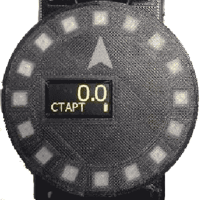
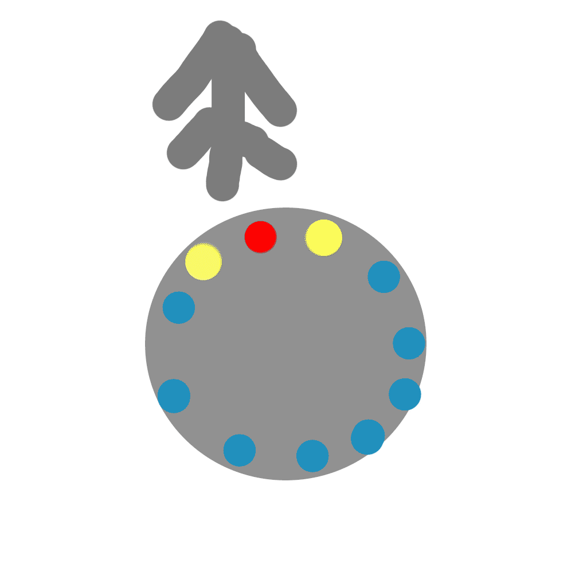

.. Световод documentation master file, created by
   sphinx-quickstart on Wed Feb 22 07:48:56 2023.
   You can adapt this file completely to your liking, but it should at least
   contain the root `toctree` directive.

Свeтовод
========

 - Показывает направление и расстояние до целевой точки (далее по тексту они будут называться точки)
   старта или заданной. В памяти прибора можно сохранить 7 точек с названиями.

 - Высоту на уровнем, запомненным во время включения.

Направление отображается с помощью 16 светодиодов, расположенных по кругу.
Красный светодиод показывает направление, а в зависимости от расстояния до точки, сбоку от красного светодиода светятся 1 или 3 желтых.

Расстояние отображается и в цифровом виде на экране.

Включение
---------

Управление прибором осуществляется с помощью двух кнопок - левой и правой.

Для включения прибора, необходимо нажать и удерживать левую кнопку, после того как включится дисплей отпустить.

Как только будет принят валидный сигнал со спутника, светодиодами отобразится направление движения относительно точки и на дисплее будет указано расстояние до точки старта (прибор автоматически при включении запоминает точку старта и переходит на неё.

Управление
----------

На дисплее прибора можно выводить отображение расстояния до точки, либо отображение высоты. При включении прибора высота обнуляется. Переключение между высотой и расстоянием осуществляется нажатием правой кнопки.

Меню настроек
-------------

Вход в меню и выход из него осуществляется длинным нажатием левой кнопки, перемещение по пунктам меню коротким нажатием левой кнопки.

В меню прибора можно выбрать точку, изменить её название, изменить её координаты и изменить яркость светодиодов.

Для выбора точки, необходимо войти в меню, выбрать пункт ВЫБОР ТЧ., затем нажать правую кнопку для входа в этот режим, далее короткими нажатиями левой кнопки выбрать нужную точку и нажатием правой кнопки подтвердить выбор.

Для изменения названия точки, необходимо в меню выбрать пункт ИЗМ.НАЗВ, затем нажать правую кнопку для входа в этот режим, далее короткими нажатиями левой кнопки выбрать нужную точку и нажатием правой кнопки подтвердить выбор, после этого можно редактировать название выбранной точки

Для изменения координат, необходимо в меню выбрать пункт ИЗМ.КООРД, затем нажать правую кнопку для входа в этот режим, далее короткими нажатиями левой кнопки выбрать нужную точку и нажатием правой кнопки подтвердить выбор, после этого можно редактировать координаты выбранной точки.

Для изменения яркости светодиодов, необходимо в меню выбрать пункт ЯРКОСТЬ, затем нажать правую кнопку для входа в этот режим, далее короткими нажатиями левой кнопки выбрать нужную яркость светодиодов и нажатием правой кнопки подтвердить выбор.

Выключение
----------
Выключение прибора осуществляется одновременным нажатием и удержанием в течении 5 секунд обеих кнопок, либо через меню, выбрав пункт ВЫКЛЮЧЕНИЕ.

Зарядка встроенного аккумулятора
--------------------------------
В приборе предусмотрена зарядка аккумулятора, для этого необходимо вставить разъем micro-USB в отверстие в корпусе прибора, при этом начнут мигать деления на рисунке аккумулятора на дисплее.
При полностью разряженном аккумуляторе время зарядки составляет не менее одного часа.

