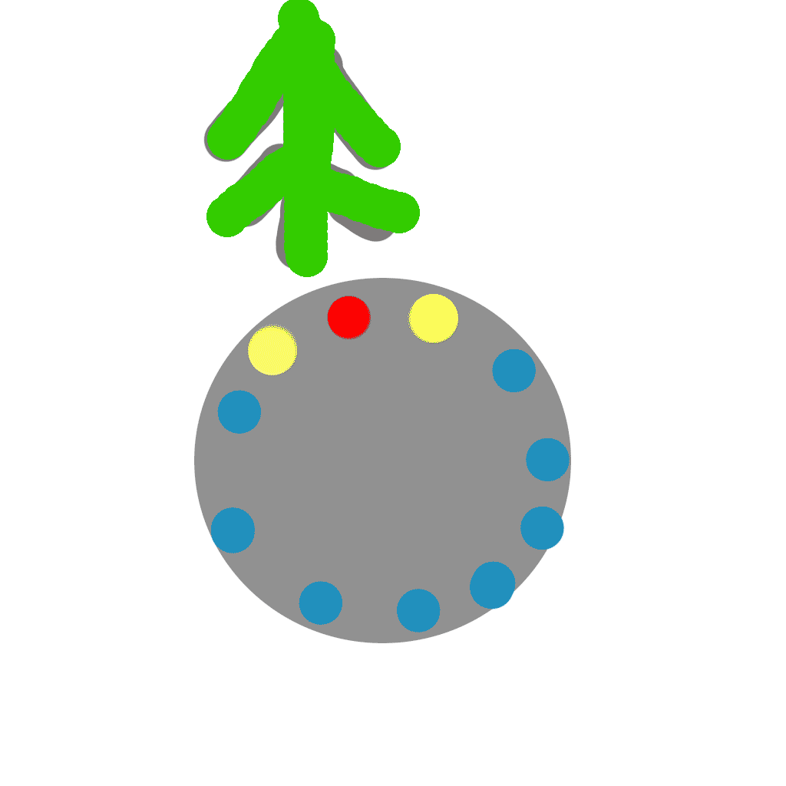

.. Световод documentation master file, created by
   sphinx-quickstart on Wed Feb 22 07:48:56 2023.
   You can adapt this file completely to your liking, but it should at least
   contain the root `toctree` directive.

Свeтовод
========
 - Показывает направление и расстояние до точки
   старта или заданной. В памяти прибора можно сохранить 7 точек с названиями.

 - Высоту на уровнем, запомненным во время включения.

Направление отображается с помощью 16 светодиодов, расположенных по кругу.
Расстояние отображается в цифровом виде на экране.

Управление
----------
Управление прибором осуществляется с помощью двух кнопок.

Для включения прибора, необходимо нажать и удерживать левую кнопку, после того как включится дисплей

необходимо отпустить кнопку.

